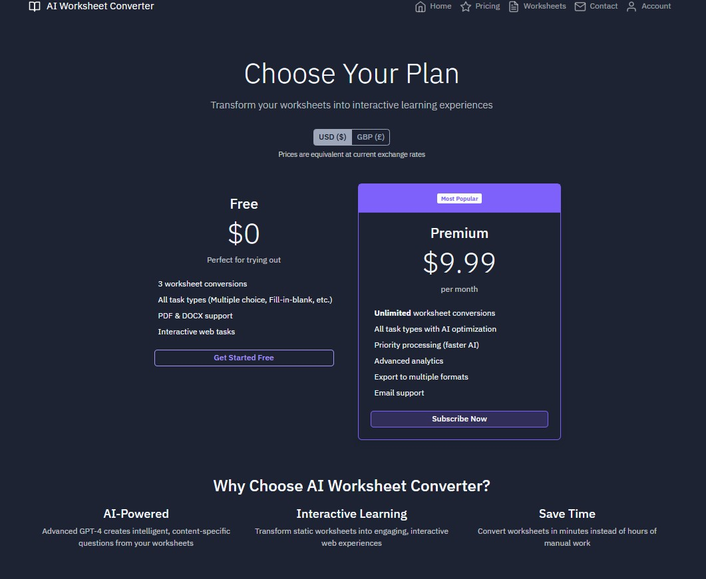

# AI Worksheet Converter

An easy-to-use web app that transforms traditional educational worksheets into engaging, interactive tasks — ideal for homeschooling, tutoring, or classroom use.

---

## 🌟 What It Does

Upload a PDF or Word worksheet and watch it turn into live interactive tasks in seconds. No coding, no manual formatting — just smarter worksheets powered by GPT-4.

- Converts **PDF, DOCX, and DOC** files
- Automatically generates **multiple-choice, fill-in-the-blank, drag-and-drop** questions
- View and manage all uploads from a single dashboard
- Built-in **free plan** with 3 trial conversions
- Upgrade for **unlimited conversions** and premium features

---

## 💻 App Overview

### 🔹 Upload Page

Upload worksheets, enter your email, and hit **Generate Interactive Tasks**.


---

### 🔹 Pricing Plans

Simple pricing with a generous free tier and affordable monthly upgrade.



---

### 🔹 My Worksheets Dashboard

All uploaded worksheets are stored here, with task generation status and access to view completed tasks.


---

### 🔹 Subscription Management

Track your usage, membership tier, and upgrade easily when needed.


---

### 🔹 Contact Form

Have a question? Reach out via the built-in contact form.


---

## ⚙️ How It Works

1. **Upload** your worksheet (PDF, DOCX, or DOC)
2. **AI Analyses** and extracts key educational content
3. **Tasks Are Generated** — multiple choice, drag-and-drop, fill-in-the-blank
4. **Interact Online** — perfect for digital classrooms

---

## 🚀 Getting Started (For Devs)

To run this locally or modify it:

```bash
git clone https://github.com/ruvel-ai-dev/Interactive_worksheets.git
```

Then follow the setup guide inside the project directory.

---

## 🔧 Tech Stack

- **GPT-4** via OpenAI for intelligent content parsing
- **Flask** backend with interactive front-end features
- File upload and task storage handled within the app

---

## 🧾 License

This project is licensed under the MIT License.

---

## ✉️ Contact

Made by Ruvel Miah  
For issues, feedback, or collaboration, feel free to open an issue or get in touch via GitHub.
